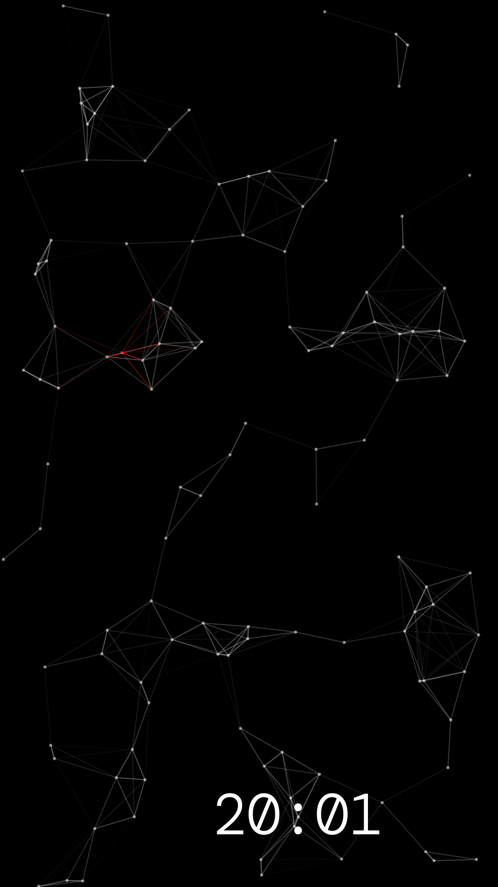

# Particle Clock

A minimal always-on clock for AMOLED screens. A drifting field of connected
particles fills the screen, and the time quietly fades to a new random spot
every so often so nothing burns into the panel.



## Features

- Full-screen particle field with an occasional red accent particle
- Clock fades to a new random position across the whole screen at regular
  intervals, and never gets stuck off-screen on rotation
- Keeps the screen awake, works in any orientation
- Long-press to open settings: clock size, particle count, red particle
  chance and brightness

## Build

```
./gradlew assembleDebug
```
